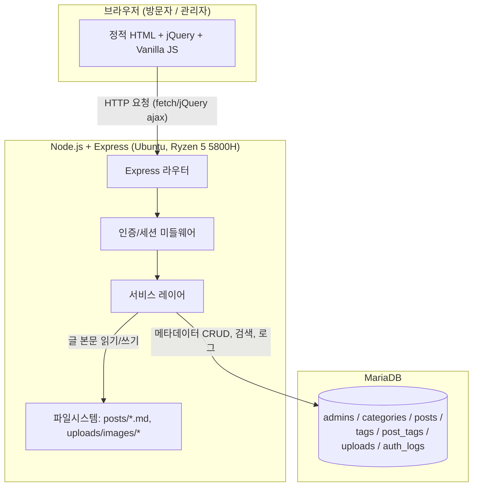
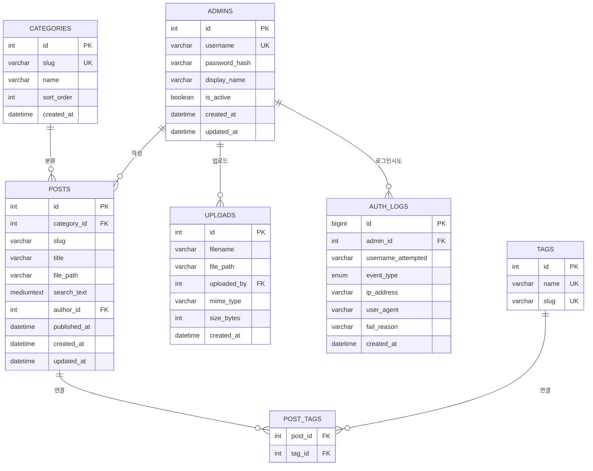

# 개인 포트폴리오 블로그 프로젝트 명세서

이 문서는 프로젝트의 전체 요구사항을 담은 단일 명세서다. 이 문서 하나만으로 프로젝트를 처음부터 구현할 수 있어야 한다.

---

## 1. 프로젝트 개요

**무엇을 만드는가**
Markdown 기반 글쓰기 + 카테고리 분류 + 검색 + 이미지 삽입이 가능한 개인 포트폴리오 블로그. AMD Ryzen 5 5800H 노트북(Ubuntu)에서 직접 호스팅한다. 방문자는 별도 로그인 없이 모든 글을 열람/검색할 수 있고, 관리자(운영자 본인, 여러 계정 가능)만 로그인 후 노션과 유사한 방식으로 글을 작성·수정·삭제하고 이미지를 삽입할 수 있다.

**운영 환경**
- 서버: AMD Ryzen 5 5800H 노트북, Ubuntu (16GB RAM)
- 런타임: Node.js
- 데이터베이스: MariaDB (해당 Ubuntu 머신에 기존 설치되어 있는 인스턴스 사용)
- 접속: 자체 도메인 또는 IP로 외부 공개, 향후 HTTPS 적용 예정

**데이터 저장 전략 (중요 — 이 프로젝트의 핵심 설계 원칙)**
- 글의 **본문(Markdown 원문)** 은 서버 파일시스템의 `.md` 파일로 저장한다. (git으로 버전관리/백업하기 위함)
- 글의 **메타데이터**(제목, 카테고리, 태그, 작성자, 파일 경로, 검색용 텍스트, 생성/수정일)는 **MariaDB**에 저장한다.
- 카테고리, 관리자 계정, 로그인/로그아웃 이력, 업로드 이미지 메타데이터는 전부 **MariaDB**에 저장한다.
- 업로드된 이미지 원본 파일은 서버 파일시스템에 저장하고, 그 경로/메타데이터만 DB에 저장한다.
- 즉, "콘텐츠 원본은 파일, 구조화된 데이터와 조회/검색/로그는 DB"라는 하이브리드 구조다.

---

## 2. 전체 아키텍처



---

## 3. 기술 스택

| 영역 | 기술 | 비고 |
|---|---|---|
| 런타임 | Node.js (LTS) | |
| 백엔드 프레임워크 | Express | |
| 데이터베이스 | MariaDB | 기존 Ubuntu 머신에 설치된 인스턴스 사용 |
| DB 드라이버 | mysql2/promise | Connection Pool, Prepared Statement 필수 사용 |
| 세션 저장소 | express-mysql-session | 세션도 MariaDB에 저장 (서버 재시작에도 로그인 유지) |
| 인증 | express-session + bcrypt | |
| 파일 업로드 | multer | |
| 이미지 검증 | file-type | 확장자 위변조 방지용 실제 바이너리 시그니처 검사 |
| 이미지 처리 | sharp | 리사이즈, 포맷 통일, EXIF(GPS 등) 메타데이터 제거 |
| Markdown 파싱(서버) | gray-matter | frontmatter 파싱, 파일 저장 시 사용 |
| 프론트엔드 | 순수 HTML + jQuery + Vanilla JS | 프레임워크 없음 |
| Markdown 렌더링(클라이언트) | marked.js | CDN |
| XSS 방지(클라이언트) | DOMPurify | CDN, marked.js 결과물 sanitize 필수 |
| 에디터 | Toast UI Editor | CDN, Markdown/WYSIWYG 겸용, 이미지 붙여넣기 훅 지원 |
| 검색 | MariaDB FULLTEXT 인덱스 | 별도 검색엔진 없음 |
| 보안 미들웨어 | helmet, express-rate-limit, csurf | |
| 환경변수 | dotenv | |

---

## 4. 디렉토리 구조

```
portfolio-blog/
├── server/
│   ├── app.js                       # Express 앱 진입점
│   ├── config/
│   │   └── env.js                   # 환경변수 로드 및 필수값 검증
│   ├── db/
│   │   ├── pool.js                  # mysql2 Connection Pool
│   │   └── schema.sql                # 전체 테이블 DDL
│   ├── middlewares/
│   │   ├── auth.js                  # 세션 인증 확인, 미인증 시 401
│   │   ├── rateLimiter.js           # 로그인 rate limit
│   │   ├── uploadLimiter.js         # 이미지 업로드 rate limit
│   │   └── errorHandler.js          # 공통 에러 응답 처리
│   ├── routes/
│   │   ├── posts.js                 # 공개: 글 목록/상세
│   │   ├── categories.js            # 공개: 카테고리 목록
│   │   ├── search.js                # 공개: 검색
│   │   ├── auth.js                  # 로그인/로그아웃/상태확인
│   │   ├── admin.js                 # 관리자: 글/카테고리 CRUD
│   │   ├── adminUploads.js          # 관리자: 이미지 업로드
│   │   ├── adminLogs.js             # 관리자: 로그인 이력 조회
│   │   └── adminAccounts.js         # 관리자: 계정 목록/비활성화
│   ├── services/
│   │   ├── postService.js
│   │   ├── categoryService.js
│   │   ├── tagService.js
│   │   ├── searchService.js
│   │   ├── authService.js
│   │   ├── authLogService.js
│   │   ├── accountService.js
│   │   └── uploadService.js
│   ├── scripts/
│   │   └── createAdmin.js           # 최초 관리자 계정 생성용 CLI 스크립트
│   └── utils/
│       ├── sanitizeSlug.js          # 카테고리/글 slug 검증 (path traversal 방지)
│       └── markdownToPlainText.js   # 검색용 텍스트 추출
├── posts/                            # 글 원문 저장 (카테고리별 하위 디렉토리)
│   ├── dev/
│   ├── daily/
│   └── project/
├── uploads/
│   └── images/                       # 업로드 이미지 원본 (연/월 하위 디렉토리)
│       └── 2026/07/
├── public/                           # 정적 프론트엔드 파일
│   ├── index.html                    # 대시보드 (전체 글 목록)
│   ├── category.html                 # 카테고리별 글 목록
│   ├── search.html                   # 검색 결과
│   ├── post.html                     # 글 상세
│   ├── admin/
│   │   ├── login.html
│   │   ├── editor.html               # 글 작성/수정 (Toast UI Editor)
│   │   ├── logs.html                 # 로그인 이력 뷰어
│   │   └── accounts.html             # 관리자 계정 관리
│   ├── css/
│   │   └── style.css
│   └── js/
│       ├── common.js                  # 공통 유틸 (네비게이션, fetch 래퍼 등)
│       ├── dashboard.js
│       ├── category.js
│       ├── search.js
│       ├── post-viewer.js
│       ├── admin-login.js
│       ├── admin-editor.js
│       ├── admin-logs.js
│       └── admin-accounts.js
├── .env
├── .env.example
├── .gitignore
└── package.json
```

---

## 5. 데이터베이스 설계

### 5.1 ERD



### 5.2 DDL

```sql
CREATE DATABASE IF NOT EXISTS portfolio_blog
  CHARACTER SET utf8mb4 COLLATE utf8mb4_unicode_ci;

USE portfolio_blog;

CREATE TABLE admins (
  id INT AUTO_INCREMENT PRIMARY KEY,
  username VARCHAR(50) NOT NULL UNIQUE,
  password_hash VARCHAR(255) NOT NULL,
  display_name VARCHAR(100),
  is_active BOOLEAN NOT NULL DEFAULT TRUE,
  created_at DATETIME NOT NULL DEFAULT CURRENT_TIMESTAMP,
  updated_at DATETIME NOT NULL DEFAULT CURRENT_TIMESTAMP ON UPDATE CURRENT_TIMESTAMP
) ENGINE=InnoDB;

CREATE TABLE categories (
  id INT AUTO_INCREMENT PRIMARY KEY,
  slug VARCHAR(50) NOT NULL UNIQUE,
  name VARCHAR(100) NOT NULL,
  sort_order INT NOT NULL DEFAULT 0,
  created_at DATETIME NOT NULL DEFAULT CURRENT_TIMESTAMP
) ENGINE=InnoDB;

CREATE TABLE posts (
  id INT AUTO_INCREMENT PRIMARY KEY,
  category_id INT NOT NULL,
  slug VARCHAR(150) NOT NULL,
  title VARCHAR(255) NOT NULL,
  file_path VARCHAR(500) NOT NULL,
  search_text MEDIUMTEXT,
  author_id INT NOT NULL,
  published_at DATETIME,
  created_at DATETIME NOT NULL DEFAULT CURRENT_TIMESTAMP,
  updated_at DATETIME NOT NULL DEFAULT CURRENT_TIMESTAMP ON UPDATE CURRENT_TIMESTAMP,
  UNIQUE KEY uq_category_slug (category_id, slug),
  FULLTEXT KEY ft_title_search (title, search_text),
  CONSTRAINT fk_posts_category FOREIGN KEY (category_id) REFERENCES categories(id) ON DELETE RESTRICT,
  CONSTRAINT fk_posts_author FOREIGN KEY (author_id) REFERENCES admins(id) ON DELETE RESTRICT
) ENGINE=InnoDB;

CREATE TABLE tags (
  id INT AUTO_INCREMENT PRIMARY KEY,
  name VARCHAR(50) NOT NULL UNIQUE,
  slug VARCHAR(50) NOT NULL UNIQUE
) ENGINE=InnoDB;

CREATE TABLE post_tags (
  post_id INT NOT NULL,
  tag_id INT NOT NULL,
  PRIMARY KEY (post_id, tag_id),
  CONSTRAINT fk_pt_post FOREIGN KEY (post_id) REFERENCES posts(id) ON DELETE CASCADE,
  CONSTRAINT fk_pt_tag FOREIGN KEY (tag_id) REFERENCES tags(id) ON DELETE CASCADE
) ENGINE=InnoDB;

CREATE TABLE uploads (
  id INT AUTO_INCREMENT PRIMARY KEY,
  filename VARCHAR(255) NOT NULL,
  file_path VARCHAR(500) NOT NULL,
  uploaded_by INT NOT NULL,
  mime_type VARCHAR(100),
  size_bytes INT,
  created_at DATETIME NOT NULL DEFAULT CURRENT_TIMESTAMP,
  CONSTRAINT fk_uploads_admin FOREIGN KEY (uploaded_by) REFERENCES admins(id) ON DELETE RESTRICT
) ENGINE=InnoDB;

CREATE TABLE auth_logs (
  id BIGINT AUTO_INCREMENT PRIMARY KEY,
  admin_id INT NULL,
  username_attempted VARCHAR(50) NOT NULL,
  event_type ENUM('LOGIN_SUCCESS', 'LOGIN_FAIL', 'LOGOUT') NOT NULL,
  ip_address VARCHAR(45) NOT NULL,
  user_agent VARCHAR(500),
  fail_reason VARCHAR(50),
  created_at DATETIME NOT NULL DEFAULT CURRENT_TIMESTAMP,
  CONSTRAINT fk_authlog_admin FOREIGN KEY (admin_id) REFERENCES admins(id) ON DELETE SET NULL,
  INDEX idx_authlog_created_at (created_at),
  INDEX idx_authlog_admin_id (admin_id),
  INDEX idx_authlog_event_type (event_type)
) ENGINE=InnoDB;
```

### 5.3 애플리케이션 전용 DB 계정

root를 애플리케이션에서 직접 사용하지 않는다. 최소 권한 계정을 별도로 만든다.

```sql
CREATE USER 'blog_app'@'localhost' IDENTIFIED BY '강력한_비밀번호_여기에';
GRANT SELECT, INSERT, UPDATE, DELETE ON portfolio_blog.* TO 'blog_app'@'localhost';
FLUSH PRIVILEGES;
```

### 5.4 설계 노트
- `posts.file_path`는 프로젝트 루트 기준 상대 경로(예: `posts/dev/2026-07-02-example.md`)이며 **API 응답으로 클라이언트에 절대 노출하지 않는다.**
- `posts.search_text`는 글 저장/수정 시 Markdown 문법을 제거한 순수 텍스트를 추출해 함께 저장한다 (FULLTEXT 검색 대상).
- `auth_logs.admin_id`는 존재하지 않는 아이디로 로그인 시도한 경우 NULL이 된다 (`username_attempted`로 추적).
- 외래키는 `ON DELETE RESTRICT`를 기본으로 사용해 카테고리/계정 삭제 시 관련 글/로그가 고아 데이터가 되는 것을 방지한다. `post_tags`만 `CASCADE`로 글 삭제 시 태그 연결이 자동 정리되도록 한다.

---

## 6. 파일시스템 저장 규칙

### 6.1 글 원문 (`posts/`)
- 경로 규칙: `posts/{category_slug}/{post_slug}.md`
- 파일 상단에 frontmatter 포함 (사람이 파일만 봐도 메타데이터를 알 수 있도록 하기 위함이며, 조회 시 실제 소스는 DB):

```markdown
---
title: "글 제목"
date: "2026-07-02"
slug: "example-post"
category: "dev"
tags: ["portfolio", "node"]
---

본문 내용 (Markdown)
```

### 6.2 업로드 이미지 (`uploads/images/`)
- 경로 규칙: `uploads/images/{yyyy}/{mm}/{random-id}.{ext}`
- 파일명은 원본 파일명을 사용하지 않고 UUID 기반으로 재생성
- 저장 전 `sharp`로 재인코딩하여 EXIF 메타데이터(GPS 등) 제거

### 6.3 category_slug / post_slug / 파일명 검증 규칙
- 정규식 `^[a-z0-9-]+$` 만 허용
- 서버에서 파일 경로를 조립하기 전 반드시 `path.resolve` 결과가 의도한 상위 디렉토리(`posts/` 또는 `uploads/images/`) 내부인지 재검증 (path traversal 방지)

---

## 7. 환경 변수 (`.env`)

```
# 서버
PORT=3000
NODE_ENV=production

# 세션
SESSION_SECRET=랜덤한_긴_문자열

# 데이터베이스
DB_HOST=127.0.0.1
DB_PORT=3306
DB_USER=blog_app
DB_PASSWORD=강력한_비밀번호
DB_NAME=portfolio_blog

# 업로드 제한
UPLOAD_MAX_SIZE_MB=5
```

`.env.example`에는 값 없이 키만 커밋한다. `.env`는 `.gitignore`에 반드시 포함한다.

---

## 8. 백엔드 API 명세

모든 API는 JSON을 주고받는다. 에러 응답 공통 포맷:
```json
{ "error": true, "message": "사용자에게 보여줄 메시지" }
```

### 8.1 공개 API

**GET `/api/posts`**
쿼리: `?category=dev` (선택)
응답:
```json
{
  "posts": [
    {
      "id": 12,
      "title": "라즈베리파이 스마트홈 만들기",
      "slug": "smarthome-project",
      "category": { "slug": "dev", "name": "개발" },
      "tags": ["raspberrypi", "nodejs"],
      "publishedAt": "2026-07-02T10:00:00.000Z"
    }
  ]
}
```

**GET `/api/posts/:category/:slug`**
서버는 DB에서 `file_path`를 조회한 뒤 해당 `.md` 파일을 읽어 본문을 함께 반환한다.
응답:
```json
{
  "id": 12,
  "title": "라즈베리파이 스마트홈 만들기",
  "slug": "smarthome-project",
  "category": { "slug": "dev", "name": "개발" },
  "tags": ["raspberrypi", "nodejs"],
  "content": "# 마크다운 원문 텍스트...",
  "publishedAt": "2026-07-02T10:00:00.000Z",
  "updatedAt": "2026-07-02T10:00:00.000Z"
}
```
글이 없으면 `404` + `{ "error": true, "message": "글을 찾을 수 없습니다." }`

**GET `/api/categories`**
응답:
```json
{
  "categories": [
    { "slug": "dev", "name": "개발", "postCount": 8 },
    { "slug": "daily", "name": "일상", "postCount": 3 }
  ]
}
```

**GET `/api/search?q=검색어`**
`MATCH(title, search_text) AGAINST(? IN NATURAL LANGUAGE MODE)` 사용.
응답:
```json
{
  "query": "라즈베리파이",
  "results": [
    { "id": 12, "title": "라즈베리파이 스마트홈 만들기", "slug": "smarthome-project", "category": {"slug":"dev","name":"개발"}, "snippet": "...본문 중 매칭된 앞뒤 텍스트..." }
  ]
}
```
- `q`가 비어있거나 2자 미만이면 `400` 반환
- `q` 길이 100자 초과 시 `400` 반환

**GET `/uploads/images/:year/:month/:filename`**
정적 파일 서빙. 화이트리스트 확장자(`jpg`, `jpeg`, `png`, `webp`, `gif`)가 아니면 `404`.

### 8.2 인증 API

**POST `/api/auth/login`**
요청:
```json
{ "username": "kam", "password": "..." }
```
- `admins` 테이블에서 `username` 조회 → `is_active` 확인 → bcrypt 비교
- 성공/실패 모두 `auth_logs`에 INSERT (IP는 `req.ip`, User-Agent는 요청 헤더에서 추출)
- 성공 시 세션 생성, `200`
- 실패 시 (아이디 없음 / 비밀번호 틀림 / 계정 비활성) 모두 동일한 메시지로 `401`:
```json
{ "error": true, "message": "아이디 또는 비밀번호가 올바르지 않습니다." }
```
- `rateLimiter` 미들웨어로 IP당 15분 5회 제한, 초과 시 `429` + `auth_logs`에 `fail_reason: rate_limited`로 기록

**POST `/api/auth/logout`**
- 세션 파기, `auth_logs`에 `LOGOUT` INSERT

**GET `/api/auth/status`**
응답 (로그인 상태):
```json
{ "authenticated": true, "username": "kam", "displayName": "Kam" }
```
응답 (비로그인):
```json
{ "authenticated": false }
```

### 8.3 관리자 API (모두 `auth.js` 미들웨어로 세션 검증, 미인증 시 `401`)

**POST `/api/admin/posts`**
요청:
```json
{
  "title": "글 제목",
  "category": "dev",
  "slug": "new-post",
  "tags": ["nodejs", "raspberrypi"],
  "content": "# 마크다운 본문..."
}
```
처리 순서 (10.11 트랜잭션 절차 참고):
1. `.md` 파일을 임시 경로에 작성 (frontmatter + content)
2. DB 트랜잭션 시작: `posts` INSERT, `tags`/`post_tags` upsert
3. 트랜잭션 커밋 성공 시에만 임시 파일을 실제 경로(`posts/{category}/{slug}.md`)로 이동
4. 실패 시 임시 파일 삭제 및 트랜잭션 롤백
응답: `201` + 생성된 post 객체

**PUT `/api/admin/posts/:category/:slug`**
요청 본문은 POST와 동일 (부분 필드만 보내도 되며, 미포함 필드는 기존값 유지)
처리: 파일 덮어쓰기 + `posts` UPDATE + 태그 재연결, 트랜잭션 절차 동일 적용
응답: `200` + 수정된 post 객체

**DELETE `/api/admin/posts/:category/:slug`**
- `posts` DELETE (연쇄로 `post_tags` 자동 삭제) 성공 후 `.md` 파일 삭제
응답: `204`

**POST `/api/admin/categories`**
요청: `{ "slug": "project", "name": "프로젝트" }`
처리: `categories` INSERT + `posts/{slug}/` 디렉토리 생성
응답: `201`

**DELETE `/api/admin/categories/:slug`**
- 소속 글이 있으면 FK RESTRICT로 DB 레벨에서 거부됨 → `409` + 안내 메시지 반환
응답 (성공): `204`

**POST `/api/admin/uploads`**
- `multipart/form-data`, 필드명 `image`
- 처리: multer로 임시 저장 → file-type으로 실제 바이너리 시그니처 검증 → 확장자 화이트리스트 확인 → sharp로 재인코딩(EXIF 제거) → `uploads/images/{yyyy}/{mm}/{uuid}.{ext}`로 최종 저장 → `uploads` 테이블 INSERT
- 크기 제한: `UPLOAD_MAX_SIZE_MB` (기본 5MB), 초과 시 `413`
- 허용 확장자 아니거나 시그니처 불일치 시 `400`
응답:
```json
{ "url": "/uploads/images/2026/07/8f3c1a2b.webp" }
```
Toast UI Editor의 이미지 업로드 훅은 이 `url`을 받아 에디터 본문에 자동 삽입한다.

**GET `/api/admin/logs`**
쿼리: `?username=kam&event=LOGIN_FAIL&page=1&limit=50`
응답:
```json
{
  "logs": [
    {
      "id": 1023,
      "username": "kam",
      "event": "LOGIN_FAIL",
      "ip": "121.xxx.xxx.xxx",
      "userAgent": "Mozilla/5.0 ...",
      "reason": "invalid_password",
      "createdAt": "2026-07-02T10:16:01.000Z"
    }
  ],
  "page": 1,
  "totalPages": 4
}
```

**GET `/api/admin/accounts`**
응답 (password_hash 절대 포함하지 않음):
```json
{
  "accounts": [
    { "id": 1, "username": "kam", "displayName": "Kam", "isActive": true, "createdAt": "2026-07-02T00:00:00.000Z" }
  ]
}
```

**PATCH `/api/admin/accounts/:id`**
요청: `{ "isActive": false }` 또는 `{ "displayName": "새 이름" }`
- `isActive`를 `false`로 바꾸면 해당 계정의 기존 세션도 즉시 무효화되어야 함 (요청마다 세션의 계정 상태를 재확인하는 방식으로 구현)
응답: `200` + 수정된 계정 객체 (계정 생성/삭제 API는 존재하지 않음 — 8.4 참고)

### 8.4 관리자 계정 생성 (API 아님, CLI 전용)

웹 API로 계정을 생성하는 기능은 의도적으로 제공하지 않는다 (인증 우회 시 계정이 무한 생성되는 것을 원천 차단하기 위함). 계정 생성은 서버에 직접 접근 가능한 사람만 아래 커맨드로 수행한다.

```
npm run create-admin -- --username=kam
```
- 실행 시 비밀번호를 터미널 프롬프트로 입력받아 bcrypt(salt rounds 12)로 해시 후 `admins` 테이블에 INSERT
- 이 스크립트는 Express 서버가 실행 중이지 않아도 독립적으로 동작해야 한다 (`server/scripts/createAdmin.js`가 직접 `db/pool.js`를 사용)

---

## 9. 프론트엔드 화면 명세

전 화면 공통: `public/js/common.js`에 네비게이션 바 렌더링 함수, `fetchJSON()` 래퍼(에러 시 공통 처리), 날짜 포맷 함수를 둔다. 모든 페이지 상단에는 사이트 제목/네비게이션(카테고리 목록, 검색창)을 공통 컴포넌트처럼 렌더링한다.

### 9.1 `index.html` — 대시보드
- 페이지 로드 시 `GET /api/categories` → 사이드바 또는 상단에 카테고리 목록 렌더링 (이름 + 글 개수 배지)
- `GET /api/posts` → 전체 글 목록을 카드 형태로 렌더링 (제목, 카테고리 배지, 날짜, 태그)
- 카드 클릭 시 `post.html?category={slug}&slug={slug}`로 이동
- 상단 검색창에 입력 후 엔터 시 `search.html?q={입력값}`으로 이동

### 9.2 `category.html` — 카테고리별 글 목록
- URL 쿼리 `?slug=dev`에서 카테고리 slug 추출
- `GET /api/posts?category=dev` → 필터링된 글 목록 렌더링
- 사이드바에 전체 카테고리 목록을 항상 노출하고 현재 카테고리를 하이라이트 처리
- 해당 카테고리에 글이 없으면 "아직 글이 없습니다" 빈 상태 표시

### 9.3 `search.html` — 검색 결과
- URL 쿼리 `?q=검색어`에서 검색어 추출, 입력 필드에도 그대로 채워서 보여줌
- `GET /api/search?q=검색어` → 결과 카드 렌더링 (제목, 카테고리, 날짜, 매칭 스니펫)
- 검색어가 없으면 안내 문구만 표시, API 호출 생략
- 결과 0건이면 "검색 결과가 없습니다" 표시

### 9.4 `post.html` — 글 상세
- URL 쿼리 `?category=dev&slug=example-post`에서 파라미터 추출
- `GET /api/posts/:category/:slug` 호출
- 응답의 `content`(raw markdown)를 `marked.parse()`로 HTML 변환 → 반드시 `DOMPurify.sanitize()`를 거친 후에만 DOM에 삽입
- 상단에 제목, 카테고리 배지(클릭 시 `category.html`로 이동), 작성일, 태그 목록 표시
- 코드블록이 있으면 highlight.js로 하이라이팅 (선택사항, CDN 추가)
- 404 응답 시 "글을 찾을 수 없습니다" 안내 페이지로 대체 렌더링

### 9.5 `admin/login.html` — 관리자 로그인
- 아이디/비밀번호 입력 폼, 제출 시 `POST /api/auth/login`
- 페이지 진입 시 `GET /api/auth/status` 호출 → 이미 로그인 상태면 즉시 `admin/editor.html`로 리다이렉트
- 로그인 실패 시 서버가 반환한 통일된 에러 메시지만 그대로 표시 (구체적 사유 추측 금지)
- 로그인 성공 시 `admin/editor.html`로 이동

### 9.6 `admin/editor.html` — 글 작성/수정
- 페이지 진입 시 `GET /api/auth/status`로 미인증이면 `admin/login.html`로 즉시 리다이렉트
- 상단 네비게이션에 로그아웃 버튼 (`POST /api/auth/logout` 후 `admin/login.html`로 이동), 로그 뷰어/계정 관리 페이지로 가는 링크
- 좌측: 기존 글 목록(전체 카테고리 글을 관리자 API가 아닌 공개 `GET /api/posts`로 불러와 표시) — 클릭 시 해당 글 내용을 에디터에 로드하여 "수정 모드"로 전환
- 우측/메인: Toast UI Editor 인스턴스
  - 상단에 제목 입력 필드, 카테고리 선택 드롭다운(`GET /api/categories`로 옵션 구성, "새 카테고리 만들기" 옵션 포함 — 선택 시 슬러그/이름 입력 받아 `POST /api/admin/categories` 호출), 태그 입력 필드(콤마 구분 텍스트 입력)
  - 본문 영역에 이미지 드래그앤드롭/붙여넣기 시 Toast UI Editor의 `addImageBlobHook`을 이용해 자동으로 `POST /api/admin/uploads` 호출 → 반환된 `url`을 에디터 본문에 이미지로 자동 삽입
  - 업로드 중 로딩 표시, 실패 시 에러 토스트(크기 초과/형식 오류 등 서버 메시지 그대로 노출)
- 저장 버튼: 신규 글이면 `POST /api/admin/posts`, 수정 모드면 `PUT /api/admin/posts/:category/:slug` 호출
- 삭제 버튼(수정 모드에서만 표시): confirm 다이얼로그 → 확인 시 `DELETE /api/admin/posts/:category/:slug`

### 9.7 `admin/logs.html` — 로그인 이력 뷰어
- 인증 체크는 9.6과 동일한 방식
- 상단 필터: 계정(username) 드롭다운(`GET /api/admin/accounts`로 목록 구성), 이벤트 타입(전체/성공/실패/로그아웃) 드롭다운
- 필터 변경 시 `GET /api/admin/logs?username=...&event=...&page=1` 재호출
- 테이블 컬럼: 시간, 계정, 이벤트, IP, User-Agent, 실패 사유
- `LOGIN_FAIL`이 짧은 시간 내 다수 발생한 구간은 행 배경을 강조 표시 (클라이언트에서 시간 간격 계산하여 처리)
- 하단 페이지네이션 (이전/다음, 페이지 번호)

### 9.8 `admin/accounts.html` — 관리자 계정 관리
- 인증 체크는 9.6과 동일
- `GET /api/admin/accounts` → 계정 목록 테이블 (아이디, 표시 이름, 활성 상태, 생성일)
- 각 행에 활성/비활성 토글 스위치 → `PATCH /api/admin/accounts/:id`
- 신규 계정 생성 버튼은 두지 않고, "새 계정은 서버에서 `npm run create-admin` 명령으로 생성하세요" 안내 문구만 표시

---

## 10. 보안 요구사항 (전체 통합)

### 10.1 인증/세션
- 비밀번호는 bcrypt(salt rounds 12)로 해시, 평문 저장 금지
- 세션 쿠키: `httpOnly: true`, `secure: true`(프로덕션 HTTPS), `sameSite: 'strict'`
- 세션 idle timeout 설정 (예: 2시간)
- 로그인 실패 메시지는 아이디 존재 여부와 무관하게 항상 동일한 문구
- 계정 비활성화(`is_active = false`) 시 기존 세션도 즉시 무효화 (매 요청마다 DB에서 계정 상태 재확인)

### 10.2 로그인 시도 제어
- IP당 15분 5회로 rate limit, 초과 시 `auth_logs`에 `rate_limited` 사유로 기록

### 10.3 SQL 인젝션 방지
- 모든 쿼리는 Prepared Statement(`pool.execute(sql, [params])`)만 사용, 문자열 결합 금지
- 정렬 컬럼 등 파라미터 바인딩이 불가능한 부분은 화이트리스트 배열 대조 후 사용

### 10.4 DB 계정 권한 최소화
- 애플리케이션 전용 DB 계정은 해당 스키마에 `SELECT/INSERT/UPDATE/DELETE`만 보유, `DROP/ALTER/GRANT/FILE` 금지
- MariaDB는 `bind-address 127.0.0.1`로 로컬 전용, 외부에서 3306 포트 직접 접근 차단

### 10.5 Path Traversal 방지
- 카테고리 slug, 글 slug, 업로드 파일명 모두 `^[a-z0-9-]+$` 화이트리스트 정규식 검증
- 파일 경로 조립 후 `path.resolve` 결과가 의도한 루트 디렉토리 내부인지 재검증

### 10.6 이미지 업로드 보안
- 파일 크기 제한(`UPLOAD_MAX_SIZE_MB`)
- 확장자 화이트리스트 + `file-type`으로 실제 바이너리 시그니처 검증 (Content-Type 헤더 신뢰하지 않음)
- 파일명 UUID 랜덤화
- `sharp` 재인코딩으로 EXIF(GPS 등) 제거 — 가정 내 개인 서버 운영 특성상 위치정보 노출 방지 목적
- 업로드 API 전용 rate limit 적용
- 업로드 API는 반드시 인증 필요

### 10.7 검색 보안
- 검색어는 Prepared Statement로만 전달, 정규식 인젝션 방지를 위해 사용자 입력을 서버에서 `RegExp` 생성에 직접 사용하지 않음
- 검색어 길이 제한(100자)

### 10.8 XSS 방지
- 클라이언트에서 marked.js 렌더링 결과는 반드시 DOMPurify로 sanitize 후 DOM 삽입
- 로그 뷰어의 User-Agent, username 등도 `textContent`로 삽입하거나 sanitize 처리 (신뢰하지 않는 입력으로 취급)

### 10.9 CSRF 방지
- 상태 변경 API(POST/PUT/PATCH/DELETE)에 CSRF 토큰 검증 적용, 또는 `sameSite: 'strict'` 쿠키 + 커스텀 헤더 검증 조합

### 10.10 HTTP 보안 헤더
- `helmet` 적용, CSP에 사용하는 CDN(marked.js, DOMPurify, Toast UI Editor, jQuery, highlight.js) 도메인 명시적 허용

### 10.11 트랜잭션 무결성
- 글 생성/수정처럼 파일 IO + 다중 테이블 반영이 함께 일어나는 작업은 반드시 아래 절차를 따른다:
  1. `.md` 파일을 임시 경로에 먼저 작성
  2. DB 트랜잭션 시작 → INSERT/UPDATE 수행
  3. 트랜잭션 커밋 성공 시에만 임시 파일을 실제 경로로 이동(rename)
  4. 트랜잭션 실패 시 임시 파일 삭제, 파일 이동 실패 시 DB 트랜잭션도 롤백
- 이 순서를 지키지 않으면 "파일은 저장됐는데 DB엔 없음" 또는 그 반대의 불일치 상태가 발생할 수 있다

### 10.12 에러 노출 최소화
- DB 에러 메시지, SQL 문법, 파일 경로 등 내부 구조를 유추할 수 있는 정보를 클라이언트 응답에 절대 포함하지 않음
- `NODE_ENV=production`에서 상세 스택은 서버 로그에만 기록

### 10.13 환경변수/시크릿
- `SESSION_SECRET`, DB 접속 정보 등은 `.env`로 분리, `.gitignore` 처리, `.env.example`만 커밋

### 10.14 배포
- 프로덕션 HTTPS 필수 (Let's Encrypt 등)
- `/admin/*` 경로는 `robots.txt`로 검색엔진 인덱싱 차단

---

## 11. 비기능 요구사항

- 요청 로깅(morgan) 적용, 비밀번호 등 민감정보는 로그에서 마스킹
- `mysql2` Connection Pool의 `connectionLimit`은 개인 서버(단일 사용자 트래픽 수준)를 고려해 적정값(예: 10)으로 설정 — 5800H + 16GB RAM 환경이라 라즈베리파이 대비 리소스 여유는 있으나 프로덕션 웹서버·DB·기타 로컬 프로세스가 동시에 돌아갈 수 있으므로 과도하게 크게 잡지 않는다
- `package.json` 스크립트: `dev`(nodemon), `start`(프로덕션), `create-admin`

---

## 12. 향후 확장 (지금 구현 범위 아님, 설계에 영향 주지 않도록 주의)

- RSS 피드 생성
- `auth_logs` 오래된 로우 아카이빙 및 이상 로그인 탐지 알림(이메일/텔레그램 등)

---

## 13. 구현 순서

1. `package.json`, 전체 디렉토리 구조 생성
2. `.env.example` 작성, `env.js` 로드/검증
3. MariaDB에 `schema.sql` 적용, 애플리케이션 전용 DB 계정 생성, `db/pool.js` 구성
4. `accountService.js` + `scripts/createAdmin.js` 구현 및 테스트 계정 1개 생성
5. `categoryService.js`, `tagService.js` (DB CRUD)
6. `postService.js` — 파일 IO + DB 메타데이터, 10.11 트랜잭션 절차 준수
7. `searchService.js` — FULLTEXT 쿼리
8. 공개 라우트: `posts.js`, `categories.js`, `search.js`
9. `authLogService.js`, `authService.js`, `auth.js` 라우트/미들웨어 — bcrypt, express-session, 세션 상태 재확인 로직
10. `uploadService.js`, `adminUploads.js` — multer, file-type, sharp, DB 기록
11. `admin.js`, `adminLogs.js`, `adminAccounts.js` — 인증 미들웨어 적용 확인
12. 보안 미들웨어: helmet, rate-limit(로그인/업로드 각각), csrf
13. 프론트엔드 공통(`common.js`) 먼저 구현 후 8개 페이지 순서대로 구현: `index.html` → `category.html` → `search.html` → `post.html` → `admin/login.html` → `admin/editor.html`(이미지 업로드 훅 포함) → `admin/logs.html` → `admin/accounts.html`
14. 전체 플로우 통합 테스트: 계정 생성(CLI) → 로그인(auth_logs 기록 확인) → 카테고리 생성 → 이미지 포함 글 작성(파일+DB 동시 반영 확인) → 대시보드/카테고리별/검색에서 조회 확인 → 글 수정 → 로그 뷰어에서 계정/이벤트 필터 확인 → 계정 비활성화 후 세션 즉시 무효화 확인 → 글 삭제 → 로그아웃
