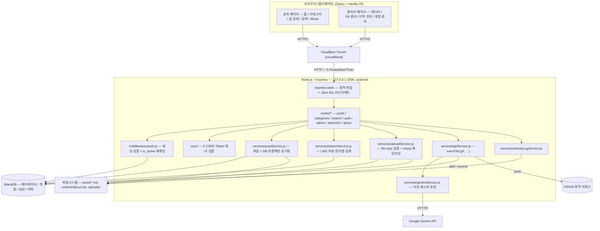

# 개요

이 블로그(`blog.doomfan.win`)를 직접 만들면서 정리한 구조 노트다.

Markdown 파일 + MariaDB를 함께 쓰는 하이브리드 저장 구조의 개인 블로그로, Node.js/Express 위에서 직접 라우팅·인증·업로드·검색까지 구현했다. 관리자 화면에서 글을 쓰면 파일시스템(`.md`)과 DB가 트랜잭션 단위로 같이 갱신되고, 최근에는 저장한 글을 관리자 대시보드에서 바로 git에 커밋·푸시하는 기능까지 붙였다.

---

# 시스템 구성

| 구성 요소 | 역할 |
| --- | --- |
| Node.js + Express 서버 | API + 정적 페이지 서빙, `systemd` 서비스(`portfolio-blog.service`)로 상시 구동, `127.0.0.1`에만 바인딩 |
| MariaDB | 글 메타데이터(제목/카테고리/태그/검색텍스트), 관리자 계정, 세션, 활동 이력 저장 |
| 파일시스템 (`posts/`, `content/about.md`, `uploads/`) | 글 본문 원문(.md), About 페이지, 업로드 이미지 원본 — DB에는 경로만 저장 |
| Cloudflare Tunnel (`cloudflared`) | 서버가 외부 인터페이스에 직접 노출되지 않도록, `blog.doomfan.win` → `localhost:3000`을 프록시하는 유일한 접근 경로 |
| Google Gemini API | Git 커밋 메시지 추천 (선택 기능, 키 없으면 이 기능만 비활성화) |
| GitHub | 글 변경사항의 버전 관리 — 관리자 대시보드에서 직접 커밋·푸시 |

---

# 기술 스택

**백엔드**

- Node.js + Express, MariaDB (`mysql2/promise`, 전부 프리페어드 스테이트먼트)
- `express-session` + `express-mysql-session` — 세션도 DB에 저장
- `bcrypt`(비밀번호 해싱), `csurf`(CSRF 토큰 검증), `express-rate-limit`(로그인 시도 제한)
- `multer` + `file-type`(바이너리 시그니처로 실제 파일 종류 검증) + `sharp`(리사이즈 + EXIF 제거)
- `helmet` — CSP 등 보안 헤더, 인라인 스크립트는 sha256 해시로만 허용
- `child_process.execFile` — git 자동화, 항상 인자 배열만 사용(셸 문자열 조립 금지)

**프론트엔드**

- 순수 HTML + jQuery + Vanilla JS — 번들러 없는 멀티페이지 구조 (SPA 전환은 이 규모엔 과하다고 판단해 보류)
- `marked.js` + `DOMPurify` — 마크다운 렌더링 + 새니타이즈
- `highlight.js`(`@highlightjs/cdn-assets` 번들) — 코드 하이라이팅
- Toast UI Editor — 관리자 글쓰기 에디터 (이것만 CDN 사용, 나머지 라이브러리는 전부 `/vendor`로 자체 호스팅)

---

# 기능 목록

| 기능 | 설명 |
| --- | --- |
| 글 목록 / 상세 | 로그인 없이 전체 열람, 카테고리별 보기, 이름·날짜·수정순 × 오름/내림차순 정렬 (클라이언트에서 재정렬, 재요청 없음) |
| 검색 | `LIKE '%...%'` 부분 문자열 매칭 — 한글 2글자 검색어도 정상 검색됨 (FULLTEXT는 한글 짧은 토큰을 못 찾아 포기) |
| 페이지네이션 | 전체 글 목록·이력 조회 화면에서 10 / 25 / 50개씩 보기 |
| 글 작성 / 수정 / 삭제 | Toast UI Editor 기반, 로그인 상태에서만 버튼이 보이고 눌러야 에디터로 진입 (항상 켜진 "관리자 모드" 없음) |
| 카테고리 관리 | 에디터 화면 인라인 폼으로 생성, 글이 남아있는 카테고리는 삭제 차단 |
| About 페이지 | DB 없이 `content/about.md` 파일 하나로만 관리 |
| 이미지 업로드 | 바이너리 시그니처 검증 후 `sharp`로 재인코딩해 EXIF 제거 (움짤 GIF는 프레임 보존을 위해 원본 그대로 통과) |
| 계정 관리 | 관리자 활성/비활성 전환 — 모든 요청마다 `is_active`를 DB에서 재확인해 비활성화 즉시 반영 |
| 이력 조회 | 로그인/로그아웃, 글 작성·수정·삭제, git 커밋·푸시까지 한 화면에서 필터 + 페이지네이션으로 조회 |
| Git 관리 | 아직 커밋 안 된 `posts/`·About 변경사항을 체크박스로 골라, Gemini가 추천한 커밋 메시지로 한 번에 커밋·푸시 |
| 다크모드 | 라이트 / 다크 / 자동 3가지, `localStorage` 저장, 첫 페인트 전에 적용되는 인라인 스크립트 |
| 클린 URL | 모든 페이지가 `.html` 없는 경로로 서빙 (`.html` 접근 시 301 리다이렉트) |

---

# 시스템 아키텍처 흐름도



---

# 인증 흐름

```
관리자 로그인 요청 (username/password)
→ bcrypt 비밀번호 검증 + is_active 확인
→ 성공 시 세션 생성 (express-mysql-session, MariaDB sessions 테이블), LOGIN_SUCCESS 기록
→ 실패 시 LOGIN_FAIL 기록 + 레이트리밋 카운트 증가
→ 이후 모든 /api/admin/* 요청마다 미들웨어가 세션의 adminId로 DB를 재조회해 is_active 재확인
  (계정을 비활성화하면 이미 로그인된 세션도 다음 요청에서 즉시 튕겨나감)
→ 모든 변경 요청(POST/PUT/DELETE)은 먼저 GET /api/csrf-token으로 받은 토큰을
  X-CSRF-Token 헤더에 실어야 csurf 검증을 통과
→ 로그아웃 시 세션 파기 + LOGOUT 기록
```

---

# Git 커밋 & 푸시 흐름

글을 웹 에디터로 저장해도 git에는 자동으로 올라가지 않는다 — 관리자가 `/admin/git` 페이지에서 직접 골라야 한다.

```
/admin/git 접속
→ GET /status: posts/, content/about.md 아래 커밋 안 된 변경사항을
  `git status --porcelain`으로 조회해 new / modified / deleted로 표시
→ 관리자가 커밋할 항목 체크 (기본은 전체 선택)
→ "메시지 추천받기": 선택된 파일 내용을 Gemini API로 보내
  "<이모지> <type>: <설명>" 한 줄을 추천받음 (그대로 쓰거나 직접 수정)
→ "선택 항목 커밋 & 푸시": 서버가 각 경로를
  posts/{category}/{slug}.md 또는 content/about.md 형식으로 다시 검증한 뒤
  execFile로 git add → git commit -m <message> -- <paths> → git push 실행
→ 성공하면 GIT_COMMIT_PUSH 이벤트로 이력 조회에 기록됨
```

---

# 향후 검토 사항

- 지금은 DB가 유일한 소스이므로, VSCode 등에서 `posts/` 아래 `.md` 파일을 직접 추가해도 DB에 메타데이터 행이 없으면 목록에 노출되지 않는다. 웹 에디터를 거치지 않고 파일만 추가하는 흐름을 지원하려면 별도의 동기화 로직이 필요하다.
- `activity_logs.event_type`처럼 스키마 변경이 필요한 기능을 추가할 때마다, 앱 전용 DB 계정(`blog_app`)이 DDL 권한이 없어 배포 서버에서 수동으로 `ALTER TABLE`을 실행해야 한다.
- Git 커밋·푸시 기능은 배포 호스트에 미리 git push 자격증명(`credential.helper store` + PAT)이 설정돼 있어야 동작한다 — 새 호스트에 배포할 때 빠뜨리기 쉬운 부분이라 별도 체크리스트로 남겨둘 만하다.
---
# Github
- https://github.com/dngur521/portfolio-blog
